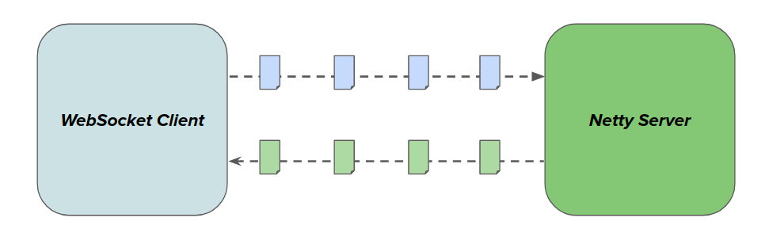

# Real Time Chat App Using WebFlux, WebSockets & Javascript
Basic chat functions using spring-boot

## Table of Contents

- [Overview](#overview) 
- [Features](#features)
- [Dependencies](#dependencies)
- [Why Reactive Streams](#why-reactive-streams)
- [Basic Architecture](#basic-architecture)
- [Run It](#run-it)
- [Frontend](#frontend)

## Overview
microservice which accepts Websocket connections that enable users to exchange chat messages in realtime.

## Features
* Accept and broadcast chat messages including user joining the chat.
* Search in the chat.
* Retrieve chat history to certain limit when user connects.

## Dependencies
* java 11
* Spring Boot 2.5.6
* Spring webflux and reactive streams
* Spring flux integration
* lombok

## Why Reactive Streams
The major application of Reactive Streams lies in the ability to build non-blocking programs that require only a small number of threads to scale. Traditional Servlet Spec applications use a request-per-thread model. That means for every HTTP request a thread is allocated to process it. Should that particular request run an expensive database query or communicate with an external service, the allocated thread will block while it waits for a response.

Contrast that to a reactive application, where the request is seen as an event being processed by a shared pool of threads. If the request depends on an external service, the specification provides an efficient way to release that thread until the resource completes, freeing it up to process other requests or deal with any other events in the system. Once the resource completes, it is seen as a separate event that will be processed by one of the shared threads and subsequently complete the original HTTP request.

## Basic Architecture

In WebFlow, WebSockets are handled by implementing WebSocketHandler. The handler is provided with a WebSocketSession every time a connection is established. A WebSocketSession represents the connection made by a single browser. It has 2 Flux streams associated with it, the `receive()` stream for incoming messages and the `send()` stream outgoing messages.

Since not all clients will connect at the same time, the publisher is configured to retain the up to 1000 messages and replays it to any new subscribers.

## Run It
A shell file provided to facilitate running the app, run `./start.sh` from your terminal make sure that you have `mvn` and `docker` installed.
Open the browser and goto http://localhost:8080.

## Frontend
JS vanilla, HTML5 and CSS under `resources` folder. Using Springboot capability to serve frontend as static resources, configurations are  defined as code in `FrontEndConfig`.

Since we have server which keep the history up to certain limit, I decided to implement search/filtering logic in the frontend side using regex.
